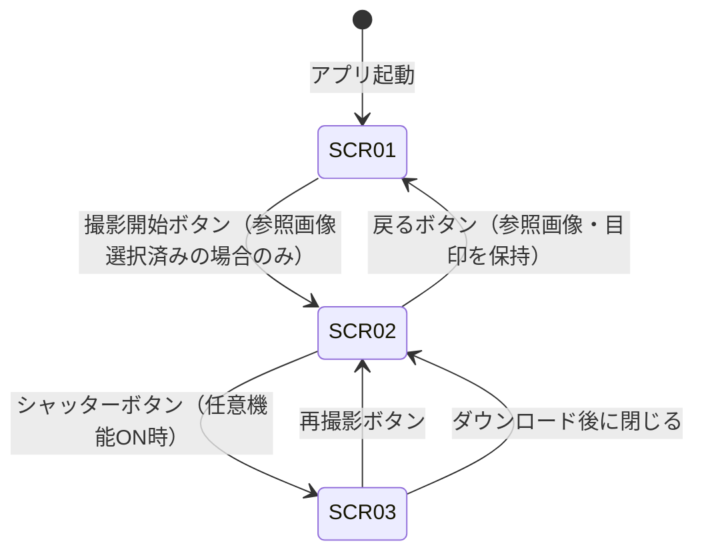

# 画面設計ドキュメント

## 概要

定点撮影ガイドWebアプリ（construction-photo-guide）の画面設計書。  
フロントエンド専用（React + TypeScript）で実装し、バックエンド・DBは使用しない。  
スマートフォン（375px〜430px幅）でのモバイルファースト設計を基本とする。

---

## アーキテクチャ

```
App（Context Provider）
├── HomeScreen（SCR-01）
│   ├── ImageUploader
│   ├── MarkerCanvas
│   │   └── MarkerDot
│   └── ActionBar
│
└── CameraScreen（SCR-02）
    ├── CameraView
    ├── OverlayCanvas
    ├── ControlPanel
    │   ├── OpacitySlider
    │   └── GridToggle
    ├── ShutterButton
    └── ResultModal（SCR-03）
        ├── ResultPreview
        ├── DownloadSelector
        └── RetakeButton
```

### 画面遷移図



---

## コンポーネントと画面設計

### SCR-01：ホーム画面（参照画像アップロード・目印設定画面）

#### 目的

参照写真をアップロードし、構図合わせの目印（マーカー）を配置する。

#### レイアウト（モバイルファースト）

```
┌─────────────────────────────┐
│  [ヘッダー: アプリ名]         │
├─────────────────────────────┤
│                             │
│  [ImageUploader]            │
│  「写真を選択」ボタン          │
│                             │
├─────────────────────────────┤
│                             │
│  [MarkerCanvas]             │
│  参照画像 + 目印オーバーレイ   │
│  （画像未選択時はプレースホルダ）│
│                             │
├─────────────────────────────┤
│  [ActionBar]                │
│  目印表示切替 | 撮影開始ボタン  │
└─────────────────────────────┘
```

#### UI要素

| 要素 | 種別 | 説明 |
|------|------|------|
| 写真を選択ボタン | `<button>` + `<input type="file">` | JPEG/PNG/HEIC/WEBP を受け付ける |
| 参照画像プレビュー | `` または `<canvas>` | アップロード後に表示 |
| 目印（MarkerDot） | `<div>` 絶対配置 | 丸アイコン、タップで削除 |
| 目印表示切替 | `<button>` トグル | 目印の表示/非表示 |
| 撮影開始ボタン | `<button>` | 参照画像未選択時はdisabled |

#### ユーザー操作フロー

1. 「写真を選択」をタップ → ファイル選択ダイアログ
2. 画像を選択 → プレビュー表示（2秒以内）
3. 画像上をタップ → 目印が追加される
4. 目印をタップ → 目印が削除される
5. 「撮影開始」をタップ → SCR-02へ遷移

---

#### コンポーネント詳細

##### `ImageUploader`

**目的**: ローカルファイルを選択し、ObjectURLを生成してContextに保存する。

**Props**

| prop名 | 型 | 説明 |
|--------|----|------|
| `onImageSelected` | `(file: File, url: string) => void` | 画像選択時のコールバック |

**State**

| state名 | 型 | 説明 |
|---------|----|------|
| `isLoading` | `boolean` | HEIC変換中などのローディング状態 |
| `error` | `string \| null` | エラーメッセージ |

**主要ロジック**
- `<input type="file" accept="image/*">` でファイル選択
- HEIC形式の場合は `heic2any` でJPEGに変換
- `URL.createObjectURL()` でObjectURLを生成
- 前のObjectURLは `URL.revokeObjectURL()` で解放

---

##### `MarkerCanvas`

**目的**: 参照画像を表示し、タップ/クリックで目印を配置・削除する。

**Props**

| prop名 | 型 | 説明 |
|--------|----|------|
| `imageUrl` | `string \| null` | 参照画像のObjectURL |
| `markers` | `Marker[]` | 目印の相対座標リスト |
| `showMarkers` | `boolean` | 目印表示フラグ |
| `onAddMarker` | `(x: number, y: number) => void` | 目印追加コールバック（相対座標） |
| `onRemoveMarker` | `(id: string) => void` | 目印削除コールバック |

**State**

| state名 | 型 | 説明 |
|---------|----|------|
| `containerSize` | `{ width: number; height: number }` | 表示領域のピクセルサイズ |

**主要ロジック**
- `getBoundingClientRect()` でコンテナサイズを取得
- クリック/タップ座標をコンテナサイズで割り、相対座標（0.0〜1.0）に変換
- `ResizeObserver` でコンテナサイズ変更を監視し再計算
- 目印のピクセル座標 = `相対座標 × containerSize`

---

##### `MarkerDot`

**目的**: 個別の目印を絶対配置で表示する。

**Props**

| prop名 | 型 | 説明 |
|--------|----|------|
| `marker` | `Marker` | 目印データ（id, x, y） |
| `containerSize` | `{ width: number; height: number }` | 親コンテナのサイズ |
| `onRemove` | `(id: string) => void` | 削除コールバック |

**State**: なし（純粋な表示コンポーネント）

**主要ロジック**
- `left: marker.x * containerSize.width`、`top: marker.y * containerSize.height` で絶対配置
- タップ/クリックで `onRemove(marker.id)` を呼び出す
- 最小タップ領域 44×44px を確保

---

##### `ActionBar`

**目的**: 目印表示切替と撮影開始ボタンを提供する。

**Props**

| prop名 | 型 | 説明 |
|--------|----|------|
| `hasImage` | `boolean` | 参照画像が選択済みかどうか |
| `showMarkers` | `boolean` | 目印表示状態 |
| `onToggleMarkers` | `() => void` | 目印表示切替コールバック |
| `onStartCamera` | `() => void` | 撮影開始コールバック |

**State**: なし

---

### SCR-02：カメラ撮影画面

#### 目的

カメラ映像に参照画像を半透明で重ねて表示し、構図を合わせて撮影する。

#### レイアウト（モバイルファースト）

```
┌─────────────────────────────┐
│  [戻るボタン]                │
├─────────────────────────────┤
│                             │
│  [CameraView]               │
│  ┌───────────────────────┐  │
│  │ <video> カメラ映像     │  │
│  │ <canvas> オーバーレイ  │  │（重ね合わせ）
│  └───────────────────────┘  │
│                             │
├─────────────────────────────┤
│  [ControlPanel]             │
│  透明度: [━━━●━━━━━]        │
│  [グリッド表示切替]           │
├─────────────────────────────┤
│  [ShutterButton]            │
│       ◎ 撮影                │
└─────────────────────────────┘
```

#### UI要素

| 要素 | 種別 | 説明 |
|------|------|------|
| 戻るボタン | `<button>` | SCR-01へ戻る（カメラ停止） |
| カメラ映像 | `<video>` | getUserMediaのストリームを表示 |
| オーバーレイCanvas | `<canvas>` | 参照画像・目印・グリッドを描画 |
| 透明度スライダー | `<input type="range">` | 0〜100%、リアルタイム反映 |
| グリッド表示切替 | `<button>` トグル | 三分割グリッドの表示/非表示 |
| シャッターボタン | `<button>` | 撮影実行（大きめ、中央配置） |

#### ユーザー操作フロー

1. SCR-01から遷移 → カメラ自動起動、オーバーレイ表示開始
2. スライダー操作 → 透明度がリアルタイムに変化
3. カメラを動かして構図を合わせる
4. シャッターボタンをタップ → 撮影実行
   - 任意機能ON: SCR-03モーダルが開く
   - 任意機能OFF: 即ダウンロード
5. 「戻る」をタップ → カメラ停止、SCR-01へ戻る

---

#### コンポーネント詳細

##### `CameraScreen`（ページコンポーネント）

**目的**: カメラ画面全体を管理するコンテナ。

**Props**

| prop名 | 型 | 説明 |
|--------|----|------|
| `onBack` | `() => void` | ホームへ戻るコールバック |

**State**

| state名 | 型 | 説明 |
|---------|----|------|
| `overlayOpacity` | `number` | オーバーレイ透明度（0.0〜1.0） |
| `showGrid` | `boolean` | グリッド表示フラグ |
| `capturedBlob` | `Blob \| null` | 撮影結果（モーダル表示用） |
| `showModal` | `boolean` | 結果確認モーダルの表示状態 |
| `cameraError` | `string \| null` | カメラエラーメッセージ |

**Ref**

| ref名 | 型 | 説明 |
|-------|----|------|
| `streamRef` | `MutableRefObject<MediaStream \| null>` | カメラストリーム（停止処理用） |

---

##### `CameraView`

**目的**: `<video>` 要素でカメラ映像を表示する。

**Props**

| prop名 | 型 | 説明 |
|--------|----|------|
| `onStreamReady` | `(stream: MediaStream, videoEl: HTMLVideoElement) => void` | ストリーム取得後のコールバック |
| `onError` | `(message: string) => void` | エラーコールバック |

**State**

| state名 | 型 | 説明 |
|---------|----|------|
| `isLoading` | `boolean` | カメラ起動中フラグ |

**Ref**

| ref名 | 型 | 説明 |
|-------|----|------|
| `videoRef` | `RefObject<HTMLVideoElement>` | video要素への参照 |

**主要ロジック**
- `useEffect` でマウント時に `getUserMedia({ video: { facingMode: 'environment' } })` を呼び出す
- アンマウント時（クリーンアップ）で `stream.getTracks().forEach(t => t.stop())` を実行
- getUserMedia非対応ブラウザは `onError` でメッセージを通知

---

##### `OverlayCanvas`

**目的**: カメラ映像の上に参照画像・目印・グリッドを `requestAnimationFrame` で描画する。

**Props**

| prop名 | 型 | 説明 |
|--------|----|------|
| `videoEl` | `HTMLVideoElement \| null` | カメラ映像のvideo要素 |
| `referenceImageUrl` | `string \| null` | 参照画像のObjectURL |
| `markers` | `Marker[]` | 目印の相対座標リスト |
| `showMarkers` | `boolean` | 目印表示フラグ |
| `opacity` | `number` | オーバーレイ透明度（0.0〜1.0） |
| `showGrid` | `boolean` | グリッド表示フラグ |
| `onCapture` | `(blob: Blob) => void` | 撮影実行コールバック |

**Ref**

| ref名 | 型 | 説明 |
|-------|----|------|
| `canvasRef` | `RefObject<HTMLCanvasElement>` | canvas要素への参照 |
| `rafIdRef` | `MutableRefObject<number>` | requestAnimationFrameのID |
| `refImageRef` | `MutableRefObject<HTMLImageElement \| null>` | 参照画像のImageオブジェクト |

**主要ロジック**
- `requestAnimationFrame` ループで毎フレーム描画:
  1. `ctx.drawImage(videoEl, ...)` でカメラ映像を描画
  2. `ctx.globalAlpha = opacity` を設定し `ctx.drawImage(refImage, ...)` で参照画像を描画
  3. `showMarkers` が true なら目印を描画
  4. `showGrid` が true なら三分割グリッドを描画
- `ResizeObserver` でcanvasサイズをvideo要素に同期
- 撮影時: `canvas.toBlob()` でBlobを取得し `onCapture` を呼び出す

---

##### `OpacitySlider`

**目的**: オーバーレイ透明度をリアルタイムに調整する。

**Props**

| prop名 | 型 | 説明 |
|--------|----|------|
| `value` | `number` | 現在の透明度（0.0〜1.0） |
| `onChange` | `(value: number) => void` | 変更コールバック |

**State**: なし（制御コンポーネント）

---

##### `ShutterButton`

**目的**: 撮影を実行する大きなボタン。

**Props**

| prop名 | 型 | 説明 |
|--------|----|------|
| `onShutter` | `() => void` | 撮影実行コールバック |
| `disabled` | `boolean` | カメラ未起動時などに無効化 |

**State**: なし

---

### SCR-03：撮影結果確認モーダル（任意機能）

#### 目的

撮影した画像をプレビューし、ダウンロード種別を選択してダウンロードする。

#### レイアウト

```
┌─────────────────────────────┐
│  ╔═══════════════════════╗  │
│  ║  [ResultPreview]      ║  │
│  ║  撮影結果プレビュー    ║  │
│  ╠═══════════════════════╣  │
│  ║  [DownloadSelector]   ║  │
│  ║  ○ 撮影結果のみ       ║  │
│  ║  ○ ガイド付き         ║  │
│  ╠═══════════════════════╣  │
│  ║  [ダウンロード] [再撮影]║  │
│  ╚═══════════════════════╝  │
└─────────────────────────────┘
```

#### コンポーネント詳細

##### `ResultModal`

**目的**: 撮影結果の確認・ダウンロード・再撮影を提供するモーダル。

**Props**

| prop名 | 型 | 説明 |
|--------|----|------|
| `capturedBlob` | `Blob` | 撮影結果画像（オーバーレイなし） |
| `overlayBlob` | `Blob \| null` | ガイド付き画像（オーバーレイあり） |
| `onRetake` | `() => void` | 再撮影コールバック |
| `onClose` | `() => void` | モーダルを閉じるコールバック |

**State**

| state名 | 型 | 説明 |
|---------|----|------|
| `downloadType` | `'clean' \| 'overlay'` | ダウンロード種別の選択状態 |

**主要ロジック**
- `URL.createObjectURL(blob)` でプレビュー用URLを生成
- ダウンロード: `<a download>` 要素を動的生成してクリック
- アンマウント時に `URL.revokeObjectURL()` で解放

---

## データモデル

### Marker型

```typescript
type Marker = {
  id: string;    // crypto.randomUUID() で生成
  x: number;     // 参照画像幅に対する相対X座標（0.0〜1.0）
  y: number;     // 参照画像高さに対する相対Y座標（0.0〜1.0）
};
```

### AppContext型

```typescript
type AppContextValue = {
  // 参照画像
  referenceImage: File | null;
  referenceImageUrl: string | null;
  setReferenceImage: (file: File, url: string) => void;

  // 目印
  markers: Marker[];
  addMarker: (x: number, y: number) => void;
  removeMarker: (id: string) => void;

  // 表示設定
  showMarkers: boolean;
  toggleShowMarkers: () => void;
};
```

---

## 状態管理の方針

### グローバル状態（React Context）

画面間で共有が必要なデータは `AppContext` で管理する。

| データ | 型 | 説明 |
|--------|----|------|
| `referenceImage` | `File \| null` | アップロードされた参照画像ファイル |
| `referenceImageUrl` | `string \| null` | 参照画像のObjectURL |
| `markers` | `Marker[]` | 目印の相対座標リスト |
| `showMarkers` | `boolean` | 目印表示フラグ |

### ローカル状態（各コンポーネントのuseState）

画面内でのみ使用するデータは各コンポーネントで管理する。

| コンポーネント | データ | 説明 |
|--------------|--------|------|
| `CameraScreen` | `overlayOpacity`, `showGrid`, `capturedBlob`, `showModal` | カメラ画面固有の状態 |
| `ImageUploader` | `isLoading`, `error` | アップロード処理の状態 |
| `ResultModal` | `downloadType` | ダウンロード種別の選択 |

### Ref（useRef）

DOMや副作用の管理に使用する。

| コンポーネント | Ref | 説明 |
|--------------|-----|------|
| `CameraScreen` | `streamRef` | カメラストリーム（停止処理用） |
| `OverlayCanvas` | `canvasRef`, `rafIdRef`, `refImageRef` | Canvas描画ループ管理 |
| `CameraView` | `videoRef` | video要素への参照 |

---

## モバイルファーストのレイアウト方針

### 基本方針

- ベースサイズ: 375px（iPhone SE相当）
- ブレークポイント: 768px以上でタブレット/PC向けレイアウトに切り替え
- 全ての操作要素は最小44×44pxのタップ領域を確保

### SCR-01のレイアウト

- 縦スクロール1カラムレイアウト
- 参照画像プレビューは画面幅いっぱいに表示（`width: 100%`、`aspect-ratio: 4/3`）
- 「撮影開始」ボタンは画面下部に固定（`position: sticky; bottom: 0`）

### SCR-02のレイアウト

- カメラ映像エリアを最大化（`flex: 1`、縦方向に伸縮）
- `<video>` と `<canvas>` は同一の親要素内に `position: absolute` で重ねる
- 親要素は `aspect-ratio: 4/3`（または `16/9`）で固定し、`object-fit: cover` でカメラ映像を収める
- コントロールパネル（スライダー・グリッド切替）は映像エリア下部に配置
- シャッターボタンは最下部中央に配置（直径72px以上）

### 向き変更（Portrait/Landscape）対応

- `ResizeObserver` でコンテナサイズ変更を検知し、canvasサイズを再計算
- Landscapeモードではカメラ映像エリアを横幅いっぱいに拡張

---

## 正確性プロパティ（Correctness Properties）

*プロパティとは、システムの全ての有効な実行において成立すべき特性・振る舞いの形式的な記述である。プロパティはヒューマンリーダブルな仕様と機械検証可能な正確性保証の橋渡しをする。*

### Property 1: 目印座標の正規化

*任意の* 参照画像表示サイズ（width, height）と任意のクリック座標（x, y）に対して、正規化後の相対座標は必ず [0.0, 1.0] の範囲内に収まる。

**Validates: Requirements 8-3.1**

### Property 2: 目印座標のラウンドトリップ

*任意の* 相対座標（rx, ry）と任意の表示サイズ（width, height）に対して、相対座標をピクセル座標に変換し、再度相対座標に変換した結果は元の相対座標と等しい。

**Validates: Requirements 8-3.2**

### Property 3: 目印追加の不変条件

*任意の* 目印リストに対して、有効な相対座標（0.0〜1.0）で目印を追加した場合、リストの長さが1増加し、追加した目印がリストに含まれる。

**Validates: Requirements F-02**

### Property 4: 目印削除の不変条件

*任意の* 目印リストに対して、存在するIDで目印を削除した場合、リストの長さが1減少し、削除した目印がリストに含まれない。

**Validates: Requirements F-03**

---

## エラーハンドリング

| エラー状況 | 対応 | 表示 |
|-----------|------|------|
| getUserMedia非対応ブラウザ | カメラ起動をスキップ | 「このブラウザはカメラに対応していません」メッセージ |
| カメラ権限拒否 | カメラ起動をスキップ | 「カメラへのアクセスが拒否されました。設定から許可してください」メッセージ |
| HEIC形式の変換失敗 | アップロードをキャンセル | 「この画像形式は対応していません。JPEG/PNG形式でお試しください」メッセージ |
| 大容量画像（目安: 10MB超） | アップロード前にリサイズ（最大2048px） | リサイズ処理中はローディング表示 |
| ObjectURL生成失敗 | アップロードをキャンセル | 「画像の読み込みに失敗しました」メッセージ |

---

## テスト戦略

### ユニットテスト（例ベース）

- `ImageUploader`: ファイル選択時にObjectURLが生成されること
- `MarkerCanvas`: クリック座標が正しく相対座標に変換されること（具体的な数値例）
- `ActionBar`: 参照画像未選択時に撮影開始ボタンがdisabledになること
- `ResultModal`: ダウンロード種別の選択が正しく反映されること

### プロパティベーステスト（fast-check使用）

各プロパティテストは最低100回のイテレーションで実行する。

**Property 1: 目印座標の正規化**
```
Feature: construction-photo-guide, Property 1: 目印座標の正規化
任意の表示サイズと任意のクリック座標に対して、正規化後の座標が[0,1]の範囲内であることを検証
```

**Property 2: 目印座標のラウンドトリップ**
```
Feature: construction-photo-guide, Property 2: 目印座標のラウンドトリップ
任意の相対座標と任意の表示サイズに対して、ピクセル変換→相対座標変換のラウンドトリップが元の値を保持することを検証
```

**Property 3: 目印追加の不変条件**
```
Feature: construction-photo-guide, Property 3: 目印追加の不変条件
任意の目印リストに対して追加操作後のリスト長と内容を検証
```

**Property 4: 目印削除の不変条件**
```
Feature: construction-photo-guide, Property 4: 目印削除の不変条件
任意の目印リストに対して削除操作後のリスト長と内容を検証
```

### 統合テスト

- カメラ起動〜撮影〜ダウンロードの一連フロー（モック使用）
- HEIC変換フロー
- 画面遷移時の状態保持（参照画像・目印がSCR-01↔SCR-02間で保持されること）
